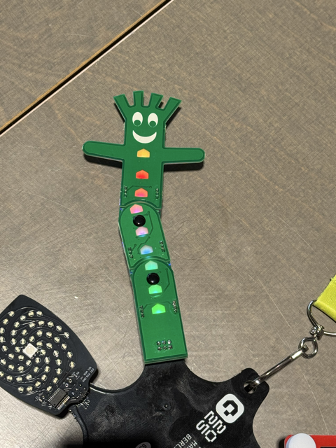

# Bendy SAO a Hackaday 2025 badge addon

This repo contain some notes and code how to get live a Bendy SAO badge addon. All work was done during the Hackaday 2025 conference in Berlin Please look at [https://hackaday.io/project/198408-bendy-sao](https://hackaday.io/project/198408-bendy-sao) for more details. 

If you want to use this addon with your Hackaday 2025 badge, please look for details in our another [repo](https://github.com/bastlirna/hackaday2025_badge).

> [!CAUTION]
> There is neccessary to keep pins `GP1` and `GP2` in `log1` (higher than 0.7 × VDD => approx. more than 2.1 Volts). There is internal 20-50kOhm pull-up in addon chip, so if you connect just power, it will work well. But this also means, if you connect this addon to your Hackaton 2025 badge, then you need drive these pins in you badge to `log1`. In case when you drive these pins to low, addon will be held in reset mode.



## Build

You can build it by (PlatformIO)[https://platformio.org] (run `pio run` in this directory).

## Flash (write code into) ATtiny via UART converter

You can use [Python MCU programmer](https://pypi.org/project/pymcuprog/) with any `USB to UART` converter.

### Wiring

| UART to USB converter pin | Add-on pin     |
|---------------------------|----------------|
| TX                        | GP2            |
| RX                        | GP1            |

### Fuses:

By default MCU uses 20MHz clock, for compatibility with Adafruit library needs to be switched to 16MHz. Be carefull, this can destroy your addon (if you do something wrong, you can lose access to programming interface). You can find details in [Atmel's datasheet](https://ww1.microchip.com/downloads/en/DeviceDoc/ATtiny3224-3226-3227-Data-Sheet-DS40002345A.pdf).

```
pymcuprog write -d attiny3224 -t uart -u /dev/usbdevice -m fuses -o 2 -l 0x7D
```

### Image write to flash

```
pymcuprog write -d attiny3224 -t uart -u /dev/usbdevice -f ./.pio/build/attiny3224/firmware.hex --erase --verify
```

## Interfacing with addon via I2C

I2C address is hardcoded to `0x2c`

### Memory (command) mapping

| name           | address     |
|----------------|-------------|
| get status     | 0x00        |
| get/set_mode   | 0x01        |
| set led collor | 0x02        |
| chop reset     | 0x05        |

### Error codes

| name             | code        |
|------------------|-------------|
| ok               | 0x00        |
| message to short | 0xa0        |
| message to long  | 0xa1        |
| invalid data     | 0x10        |
| unknown command  | 0xf0        |

### Led animation modes

*taken from [BendySAO's repository](https://github.com/geekmomprojects/BendySAO/blob/main/SuperConEurope2025/programming/strandtest_wheel_for_bendy_sao/strandtest_wheel_for_bendy_sao.ino)*

| name                   | code     |
|------------------------|----------|
| none                   | 0        |
| color wipe             | 1        |
| theater chase          | 2        |
| rainbow                | 3        |
| rainbow cycle          | 4        |
| theater chase rainbow  | 5        |

### Message(s) structure

#### set/get mode message

```
 0                 
 0 1 2 3 4 5 6 7
+-+-+-+-+-+-+-+-+
|     Mode ID   |
+-+-+-+-+-+-+-+-+

```

#### get status message

```
 0               1                  
 0 1 2 3 4 5 6 7 0 1 2 3 4 5 6 7  
+-+-+-+-+-+-+-+-+-+-+-+-+-+-+-+-+
| Vers. | Reser.|  Error Id     |
+-+-+-+-+-+-+-+-+-+-+-+-+-+-+-+-+

```

#### set led color message

*Led position id can be from 0 to 11*

```
 0               1                  
 0 1 2 3 4 5 6 7 0 1 2 3 4 5 6 7
+-+-+-+-+-+-+-+-+-+-+-+-+-+-+-+-+
|  LED pos. id  |  Red          |
+-+-+-+-+-+-+-+-+-+-+-+-+-+-+-+-+
|  Green        |  Blue         |
+-+-+-+-+-+-+-+-+-+-+-+-+-+-+-+-+
```

### microPython examples 
*... for those who rule over the serpent's language ...*

microPython I2C lib. doc. [here](https://docs.micropython.org/en/v1.15/library/machine.I2C.html)

#### Set animation mode
```
i2c1.writeto_mem(0x2c, 0x01, b'\x02')
. or .
i2c1.writeto_mem(0x2c, 0x01, b'\x04')
```

#### Set pixel color
*This will disable animation*
```
i2c1.writeto_mem(0x2c, 0x02, b'\x01\xf0\xf0\xf0')
```

#### Get animation mode
```
i2c1.readfrom_mem(0x2c, 0x01, 1)
```

#### Get device status
```
i2c1.readfrom_mem(0x2c, 0x00, 2)
```

## Acknowledgements

[https://hackaday.io/project/198408-bendy-sao](https://hackaday.io/project/198408-bendy-sao)

[https://github.com/geekmomprojects/BendySAO/tree/main](https://github.com/geekmomprojects/BendySAO/tree/main)